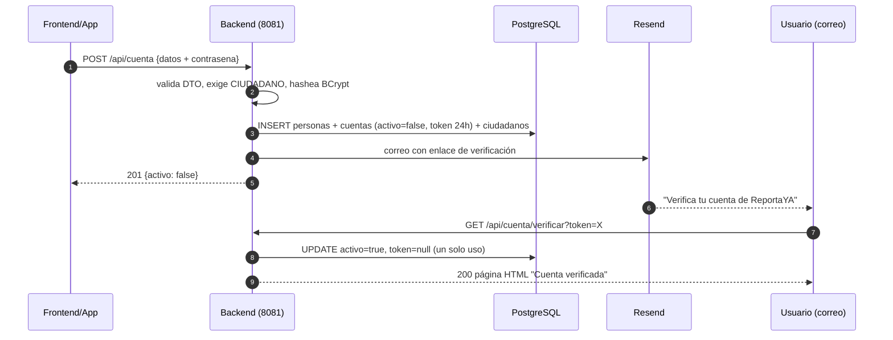
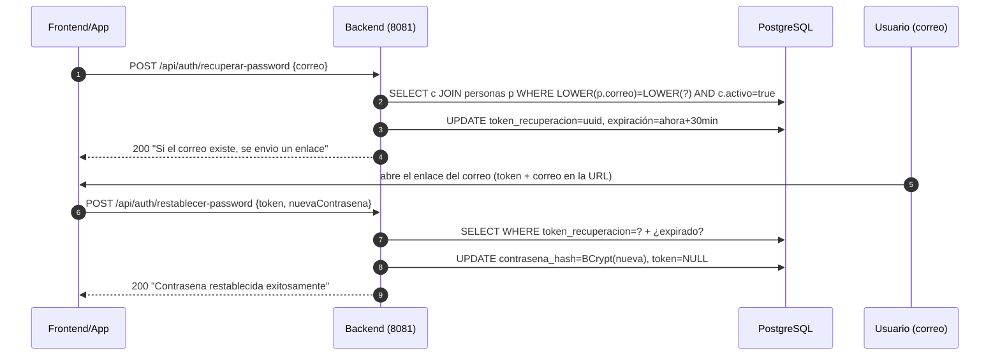

# ReportaYA Backend — Guion de sustentación

## Endpoints de Autenticación (CU-01, CU-03) y Registro/Verificación (CU-02)

Este documento es un **guion de presentación**: recorre los archivos en el orden en que conviene mostrarlos al profesor, explica **cada línea relevante del código**, muestra **el SQL exacto que se ejecuta en PostgreSQL en cada paso**, y cierra con la **demostración REST en vivo** usando los archivos de `api-tests/`.

Los 6 endpoints a sustentar:

| # | Método | Ruta | Descripción | CU |
|---|--------|------|-------------|-----|
| 1 | POST | `/api/auth/login` | Iniciar sesión (403 si la cuenta no verificó su correo) | CU-01 |
| 2 | POST | `/api/auth/recuperar-password` | Solicitar enlace de recuperación por correo | CU-03 |
| 3 | POST | `/api/auth/restablecer-password` | Restablecer contraseña usando token | CU-03 |
| 4 | POST | `/api/cuenta` | Registrar ciudadano (queda inactivo + envía correo) | CU-02 |
| 5 | GET | `/api/cuenta/verificar?token=X` | Verificar correo y activar la cuenta (devuelve HTML) | CU-02 |
| 6 | POST | `/api/cuenta/reenviar-verificacion` | Reenviar el correo de verificación | CU-02 |

### El recorrido (orden de presentación)

```
ETAPA 1          ETAPA 2            ETAPA 3           ETAPA 4         ETAPAS 5-7           ETAPA 8
Stack y     →    BD y modelo   →    Seguridad    →    Correo     →    Endpoints       →    DEMO REST
config           JPA                (BCrypt, JWT,     (Resend)        (CU-02, CU-01,       en vivo
(pom,            (tablas,           interceptor)                      CU-03) con su
properties)      entidades,                                           SQL paso a paso
                 repositorio)
```

La lógica del orden: primero los **cimientos** (qué librerías, qué tablas, qué reglas de seguridad), después la **lógica de negocio** de cada caso de uso apoyándose en esos cimientos, y al final la **prueba en vivo** donde todo lo explicado se ve funcionando (respuestas HTTP + SQL en consola + filas cambiando en pgAdmin).

---

## Índice

- [Etapa 0 — Preparación antes de la sustentación](#etapa-0--preparación-antes-de-la-sustentación)
- [Etapa 1 — Stack y configuración](#etapa-1--stack-y-configuración)
- [Etapa 2 — Base de datos y modelo JPA](#etapa-2--base-de-datos-y-modelo-jpa)
- [Etapa 3 — Seguridad: BCrypt, JWT e interceptor](#etapa-3--seguridad-bcrypt-jwt-e-interceptor)
- [Etapa 4 — Servicio de correo (Resend)](#etapa-4--servicio-de-correo-resend)
- [Etapa 5 — CU-02: Registro y verificación](#etapa-5--cu-02-registro-y-verificación)
- [Etapa 6 — CU-01: Login](#etapa-6--cu-01-login)
- [Etapa 7 — CU-03: Recuperación de contraseña](#etapa-7--cu-03-recuperación-de-contraseña)
- [Etapa 8 — Demostración REST en vivo](#etapa-8--demostración-rest-en-vivo)
- [Etapa 9 — Preguntas probables del profesor](#etapa-9--preguntas-probables-del-profesor)
- [Anexo — Tabla resumen de respuestas HTTP](#anexo--tabla-resumen-de-respuestas-http)

---

## Etapa 0 — Preparación antes de la sustentación

Checklist para que la demo salga fluida:

1. **PostgreSQL corriendo** con la BD creada ([db/crear-DB.sql](../db/crear-DB.sql), [db/crear-TABLAS.sql](../db/crear-TABLAS.sql)) y datos de prueba ([db/llenar-TABLAS.sql](../db/llenar-TABLAS.sql)).
2. **Backend levantado** en el puerto **8081** (`./mvnw spring-boot:run` o desde el IDE).
3. **pgAdmin abierto** con un Query Tool sobre la BD, para mostrar las filas cambiando en cada paso.
4. **VS Code con la extensión REST Client** y los archivos [api-tests/01-auth.rest](../api-tests/01-auth.rest) y [api-tests/02-registro.rest](../api-tests/02-registro.rest) abiertos.
5. **Consola del backend visible**: gracias a `logging.level.org.hibernate.SQL=DEBUG` ([application.properties:48](../src/main/resources/application.properties#L48)), **cada SQL que Hibernate ejecuta se imprime en vivo** — es la evidencia directa de la interacción con la base de datos.
6. Decidir el modo de correo:
   - **Con `RESEND_API_KEY` configurada** → los correos llegan de verdad (usa un correo tuyo real en el registro).
   - **Sin API key** → el enlace se imprime en la consola del backend (más rápido para demo; el código lo soporta a propósito, ver Etapa 4).

> 💡 Tip: si quieres que la consola muestre también los **valores** de los parámetros (`?`) de cada SQL, agrega `logging.level.org.hibernate.orm.jdbc.bind=TRACE` (nombre del logger en Hibernate 6; la propiedad `BasicBinder` que hay en el properties es el nombre antiguo de Hibernate 5).

---

## Etapa 1 — Stack y configuración

### 1.1 [pom.xml](../pom.xml) — qué decir primero

**💬 Qué decir:** *"El backend es Spring Boot 3.5.6 con Java 17. Para la autenticación tomé dos decisiones de dependencias deliberadas."*

**Decisión 1 — No uso Spring Security completo**, solo su módulo de criptografía ([pom.xml:67-71](../pom.xml#L67-L71)):

```xml
<!-- BCrypt password hashing only (no full Spring Security) -->
<dependency>
    <groupId>org.springframework.security</groupId>
    <artifactId>spring-security-crypto</artifactId>
</dependency>
```

Esto me da `BCryptPasswordEncoder` sin arrastrar toda la cadena de filtros de Spring Security. La protección de rutas la implemento yo con un interceptor (Etapa 3), lo que me permite **explicar y controlar cada línea** del mecanismo de seguridad.

**Decisión 2 — JWT con la librería jjwt 0.12.3** ([pom.xml:42-59](../pom.xml#L42-L59)): `jjwt-api` (compilación) + `jjwt-impl` y `jjwt-jackson` (runtime).

También: `spring-boot-starter-data-jpa` (Hibernate + Spring Data), `spring-boot-starter-validation` (las anotaciones `@NotBlank`, `@Email`, etc.), y el driver `postgresql`.

### 1.2 [application.properties](../src/main/resources/application.properties) — la configuración

**💬 Qué decir:** *"Ningún secreto está hardcodeado: todo llega por variables de entorno o por `application-local.properties`, que está en el .gitignore."*

| Propiedad | Línea | Para qué sirve |
|-----------|-------|----------------|
| `server.port=8081` | [7](../src/main/resources/application.properties#L7) | Puerto del backend |
| `spring.config.import=optional:file:./application-local.properties` | [4](../src/main/resources/application.properties#L4) | Carga los secretos locales (gitignored) |
| `jwt.secret=${JWT_SECRET}` | [11](../src/main/resources/application.properties#L11) | Clave de firma del JWT — **mínimo 32 bytes** o la app no arranca |
| `jwt.expiration-ms=${JWT_EXPIRATION_MS:86400000}` | [12](../src/main/resources/application.properties#L12) | Vida del JWT: 86 400 000 ms = **24 horas** |
| `spring.datasource.url/username/password` | [17-19](../src/main/resources/application.properties#L17-L19) | Conexión a PostgreSQL |
| `spring.jpa.hibernate.ddl-auto=update` | [24](../src/main/resources/application.properties#L24) | Hibernate sincroniza el esquema con las entidades al arrancar |
| `resend.api-key` / `resend.from` | [36-37](../src/main/resources/application.properties#L36-L37) | Credenciales del servicio de correo (vacía = modo dev) |
| `app.base-url` | [41](../src/main/resources/application.properties#L41) | Base del enlace de verificación que viaja en el correo |
| `app.password-reset-url` | [45](../src/main/resources/application.properties#L45) | URL (o deep link móvil) de la pantalla "nueva contraseña" |
| `logging.level.org.hibernate.SQL=DEBUG` | [48](../src/main/resources/application.properties#L48) | **Imprime en consola cada SQL ejecutado** (clave para la demo) |

---

## Etapa 2 — Base de datos y modelo JPA

**💬 Qué decir:** *"Antes de ver los endpoints, muestro dónde viven los datos: tres tablas participan en la autenticación, y están mapeadas 1 a 1 con mis entidades JPA."*

### 2.1 Las tablas ([db/crear-TABLAS.sql](../db/crear-TABLAS.sql))

```
┌──────────────┐  1:1   ┌───────────────────┐  herencia JOINED  ┌──────────────┐
│   personas   │◀───────│      cuentas      │◀──────────────────│  ciudadanos  │
│ datos        │        │ credenciales +    │                   │ (solo id,    │
│ personales   │        │ tokens + estado   │                   │  marca tipo) │
└──────────────┘        └───────────────────┘                   └──────────────┘
```

**`personas`** ([crear-TABLAS.sql:13-20](../db/crear-TABLAS.sql#L13-L20)) — datos personales, separados de las credenciales:

```sql
CREATE TABLE IF NOT EXISTS personas (
  id BIGSERIAL PRIMARY KEY,
  nombres VARCHAR(255) NOT NULL,
  apellidos VARCHAR(255) NOT NULL,
  dni VARCHAR(50) NOT NULL UNIQUE,      -- no puede repetirse
  telefono VARCHAR(50) NOT NULL,
  correo VARCHAR(255) NOT NULL UNIQUE   -- no puede repetirse
);
```

**`cuentas`** ([crear-TABLAS.sql:23-36](../db/crear-TABLAS.sql#L23-L36)) — credenciales, estado y los dos pares de tokens:

```sql
CREATE TABLE IF NOT EXISTS cuentas (
  id BIGSERIAL PRIMARY KEY,
  usuario VARCHAR(255) NOT NULL UNIQUE,
  contrasena_hash VARCHAR(255) NOT NULL,             -- SOLO hashes BCrypt, nunca texto plano
  persona_id BIGINT NOT NULL UNIQUE,                 -- FK 1:1 hacia personas
  fecha_creacion TIMESTAMP WITHOUT TIME ZONE,
  fecha_actualizacion TIMESTAMP WITHOUT TIME ZONE,
  activo BOOLEAN NOT NULL DEFAULT TRUE,              -- false = correo sin verificar
  token_verificacion VARCHAR(255),                   -- token del enlace de verificación (24 h)
  token_expiracion TIMESTAMP WITHOUT TIME ZONE,
  token_recuperacion VARCHAR(255),                   -- token del enlace de recuperación (30 min)
  token_recuperacion_expiracion TIMESTAMP WITHOUT TIME ZONE,
  CONSTRAINT fk_cuentas_persona FOREIGN KEY (persona_id) REFERENCES personas (id) ON DELETE RESTRICT
);
```

**`ciudadanos`** ([crear-TABLAS.sql:56-59](../db/crear-TABLAS.sql#L56-L59)) — tabla de la subclase (herencia JOINED). Solo tiene el `id`, que es a la vez PK y FK hacia `cuentas`:

```sql
CREATE TABLE IF NOT EXISTS ciudadanos (
  id BIGINT PRIMARY KEY,
  CONSTRAINT fk_ciudadanos_cuenta FOREIGN KEY (id) REFERENCES cuentas (id) ON DELETE CASCADE
);
```

Existen tablas gemelas `tecnicos` y `operadores_municipales` para los otros dos tipos de cuenta ([crear-TABLAS.sql:46-54](../db/crear-TABLAS.sql#L46-L54)).

**Detalle para sustentar rendimiento** ([crear-TABLAS.sql:130-131](../db/crear-TABLAS.sql#L130-L131)): las búsquedas por token tienen **índices** dedicados, porque los endpoints de verificación y restablecimiento buscan por esas columnas:

```sql
CREATE INDEX IF NOT EXISTS idx_cuentas_token_verificacion ON cuentas (token_verificacion);
CREATE INDEX IF NOT EXISTS idx_cuentas_token_recuperacion ON cuentas (token_recuperacion);
```

### 2.2 [Persona.java](../src/main/java/com/ulima/incidenciaurbana/model/Persona.java) — entidad de datos personales

```java
@Entity
@Table(name = "personas")                                   // mapea a la tabla personas
public class Persona {

    @Id
    @GeneratedValue(strategy = GenerationType.IDENTITY)     // el id lo genera el BIGSERIAL de PostgreSQL
    private Long id;

    @Column(nullable = false) private String nombres;
    @Column(nullable = false) private String apellidos;
    @Column(nullable = false, unique = true) private String dni;     // genera el constraint UNIQUE
    @Column(nullable = false) private String telefono;
    @Column(nullable = false, unique = true) private String correo;  // genera el constraint UNIQUE
```

Método de negocio que usa el login ([Persona.java:42-44](../src/main/java/com/ulima/incidenciaurbana/model/Persona.java#L42-L44)):

```java
public String getNombreCompleto() {
    return nombres + " " + apellidos;    // se devuelve en el LoginResponse
}
```

### 2.3 [Cuenta.java](../src/main/java/com/ulima/incidenciaurbana/model/Cuenta.java) — la entidad central (línea por línea)

**Cabecera** ([Cuenta.java:9-12](../src/main/java/com/ulima/incidenciaurbana/model/Cuenta.java#L9-L12)):

```java
@Entity
@Table(name = "cuentas")
@Inheritance(strategy = InheritanceType.JOINED)   // herencia: campos comunes en `cuentas`,
public abstract class Cuenta {                    // cada subclase en su propia tabla unida por id
```

- `abstract`: nunca existe una "Cuenta a secas" — siempre es `Ciudadano`, `Tecnico` u `OperadorMunicipal`.
- `JOINED`: al guardar un `Ciudadano`, Hibernate inserta en `cuentas` **y** en `ciudadanos` con el mismo id.

**Relación con Persona** ([Cuenta.java:24-26](../src/main/java/com/ulima/incidenciaurbana/model/Cuenta.java#L24-L26)):

```java
@OneToOne(cascade = CascadeType.ALL)                              // al guardar la Cuenta se guarda la Persona
@JoinColumn(name = "persona_id", nullable = false, unique = true) // FK en cuentas.persona_id
private Persona persona;
```

El `cascade = ALL` es la razón por la que el servicio de registro hace **un solo `save()`** y aun así se insertan las tres tablas.

**Campos de estado y tokens** ([Cuenta.java:37-50](../src/main/java/com/ulima/incidenciaurbana/model/Cuenta.java#L37-L50)):

```java
@Column(nullable = false)
private boolean activo;                            // false = correo sin verificar

@Column(name = "token_verificacion")
private String tokenVerificacion;                  // UUID del enlace de verificación

@Column(name = "token_expiracion")
private LocalDateTime tokenExpiracion;             // vence a las 24 h

@Column(name = "token_recuperacion")
private String tokenRecuperacion;                  // UUID del enlace de recuperación

@Column(name = "token_recuperacion_expiracion")
private LocalDateTime tokenRecuperacionExpiracion; // vence a los 30 min
```

**Constructor** ([Cuenta.java:53-57](../src/main/java/com/ulima/incidenciaurbana/model/Cuenta.java#L53-L57)) — inicializa fechas y nace `activo = true` (el registro público lo fuerza a `false` explícitamente, Etapa 5):

```java
public Cuenta() {
    this.fechaCreacion = LocalDateTime.now();
    this.fechaActualizacion = LocalDateTime.now();
    this.activo = true;
}
```

**Auditoría automática** ([Cuenta.java:77-80](../src/main/java/com/ulima/incidenciaurbana/model/Cuenta.java#L77-L80)) — cada vez que Hibernate hace UPDATE de una cuenta, esta callback JPA actualiza la fecha sola:

```java
@PreUpdate
public void preUpdate() {
    this.fechaActualizacion = LocalDateTime.now();
}
```

**Métodos de negocio de los tokens** ([Cuenta.java:179-215](../src/main/java/com/ulima/incidenciaurbana/model/Cuenta.java#L179-L215)) — la regla de negocio vive en la entidad (dominio rico), no dispersa en los servicios:

```java
public void asignarTokenVerificacion(String token, LocalDateTime expiracion) {
    this.tokenVerificacion = token;
    this.tokenExpiracion = expiracion;
}

public boolean tokenVerificacionExpirado() {
    return tokenExpiracion == null || tokenExpiracion.isBefore(LocalDateTime.now());
}

public void confirmarVerificacion() {
    this.activo = true;             // activa la cuenta
    this.tokenVerificacion = null;  // consume el token → UN SOLO USO
    this.tokenExpiracion = null;
}

public void cambiarContrasena(String nuevaContrasenaHash) {
    this.contrasenaHash = nuevaContrasenaHash;
    this.fechaActualizacion = LocalDateTime.now();
}

// ...y el trío equivalente para recuperación:
// asignarTokenRecuperacion / tokenRecuperacionExpirado / limpiarTokenRecuperacion
```

**El método abstracto clave** ([Cuenta.java:221](../src/main/java/com/ulima/incidenciaurbana/model/Cuenta.java#L221)):

```java
public abstract String getTipoCuenta();
```

Cada subclase devuelve su rol (`"CIUDADANO"`, `"TECNICO"`, `"OPERADOR_MUNICIPAL"`) — es lo que termina dentro del JWT y lo que el frontend usa para decidir pantallas.

### 2.4 [Ciudadano.java](../src/main/java/com/ulima/incidenciaurbana/model/Ciudadano.java) — la subclase que crea el registro

```java
@Entity
@Table(name = "ciudadanos")
public class Ciudadano extends Cuenta {

    public Ciudadano(String usuario, String contrasenaHash, Persona persona) {
        super(usuario, contrasenaHash, persona);
    }

    @Override
    public String getTipoCuenta() {
        return "CIUDADANO";
    }
}
```

No agrega columnas: su única función es **marcar el tipo** vía la tabla `ciudadanos` y el método `getTipoCuenta()`.

### 2.5 [CuentaRepository.java](../src/main/java/com/ulima/incidenciaurbana/repository/CuentaRepository.java) — las consultas y su SQL

**💬 Qué decir:** *"No escribo SQL a mano para los casos simples: Spring Data JPA genera la consulta a partir del nombre del método (derived queries). Solo uso JPQL explícito cuando necesito un JOIN."*

```java
@Repository
public interface CuentaRepository extends JpaRepository<Cuenta, Long> {

    Optional<Cuenta> findByUsuario(String usuario);              // ← usada por el LOGIN

    Optional<Cuenta> findByTokenVerificacion(String token);      // ← usada por GET /verificar

    Optional<Cuenta> findByTokenRecuperacion(String token);      // ← usada por restablecer-password

    @Query("SELECT c FROM Cuenta c JOIN c.persona p WHERE LOWER(p.correo) = LOWER(:correo) AND c.activo = true")
    Optional<Cuenta> findByCorreoAndActivoTrue(@Param("correo") String correo);  // ← recuperar-password

    @Query("SELECT c FROM Cuenta c JOIN c.persona p WHERE LOWER(p.correo) = LOWER(:correo)")
    Optional<Cuenta> findByCorreo(@Param("correo") String correo);               // ← reenviar-verificacion
}
```

Puntos a sustentar:

1. **¿Por qué `@Query` en las dos últimas?** Porque el correo **no está en `cuentas` sino en `personas`**: hay que hacer JOIN, y eso una derived query no lo expresa. Además `LOWER(...) = LOWER(...)` hace la búsqueda **case-insensitive** (`Gaby@mail.com` = `gaby@mail.com`).
2. **¿Qué SQL genera Hibernate?** Como `Cuenta` es polimórfica (JOINED), cada búsqueda hace LEFT JOIN con las tres tablas de subclase para descubrir el tipo concreto. Simplificado, `findByUsuario` produce:

```sql
SELECT c.id, c.usuario, c.contrasena_hash, c.activo, c.persona_id,
       c.token_verificacion, c.token_expiracion,
       c.token_recuperacion, c.token_recuperacion_expiracion, ...,
       CASE WHEN c1.id IS NOT NULL THEN 1      -- ¿es ciudadano?
            WHEN t.id  IS NOT NULL THEN 2      -- ¿es técnico?
            WHEN o.id  IS NOT NULL THEN 3 END  -- ¿es operador?
FROM cuentas c
LEFT JOIN ciudadanos c1             ON c1.id = c.id
LEFT JOIN tecnicos t                ON t.id  = c.id
LEFT JOIN operadores_municipales o  ON o.id  = c.id
WHERE c.usuario = ?
```

Así Hibernate sabe si debe instanciar un `Ciudadano`, un `Tecnico` o un `OperadorMunicipal` — y `getTipoCuenta()` devuelve el valor correcto sin ninguna columna "tipo" manual. La `Persona` asociada se carga también (la relación `@OneToOne` es EAGER por defecto).

3. **¿Por qué el login usa `findByUsuario` y no `findByUsuarioAndActivoTrue`?** A propósito: necesita encontrar también cuentas **no verificadas** para responder 403 (correo pendiente) en lugar de 401 (credenciales mal) — se sustenta en la Etapa 6.

---

## Etapa 3 — Seguridad: BCrypt, JWT e interceptor

### 3.1 [SecurityBeans.java](../src/main/java/com/ulima/incidenciaurbana/config/SecurityBeans.java) — el hash de contraseñas

```java
@Configuration
public class SecurityBeans {

    @Bean
    public BCryptPasswordEncoder passwordEncoder() {
        return new BCryptPasswordEncoder();
    }
}
```

**💬 Qué decir:** *"Expongo BCrypt como bean único para que registro y login usen exactamente el mismo encoder."*

- Sin argumentos = **cost factor 10** (2¹⁰ rondas internas): lo bastante lento para frenar fuerza bruta, lo bastante rápido para un login normal.
- BCrypt **genera un salt aleatorio por hash**: dos usuarios con la misma contraseña tienen hashes distintos. Por eso jamás se compara con `equals()`, sino con `passwordEncoder.matches(textoPlano, hash)`.
- En la BD se ve así: `$2a$10$N9qo8uLOickgx2ZMRZoMye...` → prefijo `$2a$`, costo `10`, luego salt+hash. **Esto se muestra en pgAdmin durante la demo.**

### 3.2 [JwtUtil.java](../src/main/java/com/ulima/incidenciaurbana/util/JwtUtil.java) — emisión y validación del token

**Constructor** ([JwtUtil.java:19-26](../src/main/java/com/ulima/incidenciaurbana/util/JwtUtil.java#L19-L26)):

```java
public JwtUtil(
        @Value("${jwt.secret}") String secret,                      // de JWT_SECRET (env)
        @Value("${jwt.expiration-ms:86400000}") long expirationMs   // default 24 h
) {
    byte[] keyBytes = secret.getBytes(StandardCharsets.UTF_8);
    this.signingKey = Keys.hmacShaKeyFor(keyBytes);   // exige ≥ 32 bytes o lanza excepción
    this.expirationMs = expirationMs;
}
```

**Generación** ([JwtUtil.java:28-40](../src/main/java/com/ulima/incidenciaurbana/util/JwtUtil.java#L28-L40)) — solo la llama el login:

```java
public String generateToken(Long cuentaId, String usuario, String tipoCuenta) {
    Date now = new Date();
    Date expiry = new Date(now.getTime() + expirationMs);

    return Jwts.builder()
            .subject(String.valueOf(cuentaId))    // claim estándar "sub" = id de la cuenta
            .claim("usuario", usuario)            // claim propio
            .claim("tipoCuenta", tipoCuenta)      // claim propio: el rol
            .issuedAt(now)                        // "iat"
            .expiration(expiry)                   // "exp" = ahora + 24 h
            .signWith(signingKey)                 // firma HMAC-SHA (HS256 con clave de 32 bytes)
            .compact();                           // serializa a "xxx.yyy.zzz"
}
```

Payload decodificado (se puede mostrar en jwt.io durante la demo):

```json
{ "sub": "12", "usuario": "jperez", "tipoCuenta": "CIUDADANO", "iat": 1730000000, "exp": 1730086400 }
```

**Validación** ([JwtUtil.java:42-48](../src/main/java/com/ulima/incidenciaurbana/util/JwtUtil.java#L42-L48)) — verifica la firma con la misma clave; si el token fue alterado o expiró, **lanza excepción**:

```java
public Claims parseClaims(String token) {
    return Jwts.parser()
            .verifyWith(signingKey)
            .build()
            .parseSignedClaims(token)   // ← aquí explota si firma inválida o expirado
            .getPayload();
}
```

**💬 Qué decir:** *"El sistema es stateless: no guardo sesiones en la BD. Toda la identidad viaja firmada dentro del token; si alguien modifica un solo carácter del payload, la firma deja de cuadrar y el request cae con 401."*

### 3.3 [WebConfig.java](../src/main/java/com/ulima/incidenciaurbana/config/WebConfig.java) + [JwtInterceptor.java](../src/main/java/com/ulima/incidenciaurbana/config/JwtInterceptor.java) — por qué estos 6 endpoints son públicos

**El registro de rutas** ([WebConfig.java:17-27](../src/main/java/com/ulima/incidenciaurbana/config/WebConfig.java#L17-L27)):

```java
@Override
public void addInterceptors(InterceptorRegistry registry) {
    registry.addInterceptor(jwtInterceptor)
            .addPathPatterns("/api/**")                      // TODO /api requiere JWT...
            .excludePathPatterns(                            // ...excepto:
                    "/api/auth/**",                          // login, recuperar, restablecer
                    "/api/cuenta",                           // POST registro
                    "/api/cuenta/verificar",                 // GET del correo
                    "/api/cuenta/reenviar-verificacion"
            );
}
```

Las 4 exclusiones cubren **exactamente los 6 endpoints públicos** — son públicos por necesidad lógica: nadie tiene token antes de registrarse o loguearse.

**El interceptor, línea por línea** ([JwtInterceptor.java:19-48](../src/main/java/com/ulima/incidenciaurbana/config/JwtInterceptor.java#L19-L48)) — corre **antes** de cualquier controlador protegido:

```java
public boolean preHandle(HttpServletRequest request, HttpServletResponse response, Object handler) throws Exception {
    if ("OPTIONS".equalsIgnoreCase(request.getMethod())) {
        return true;                                  // el preflight CORS no trae Authorization: pasa
    }

    String authHeader = request.getHeader("Authorization");

    if (authHeader == null || !authHeader.startsWith("Bearer ")) {
        response.setStatus(HttpServletResponse.SC_UNAUTHORIZED);          // 401
        response.getWriter().write("{\"error\":\"Token no proporcionado\"}");
        return false;                                 // false = el request MUERE aquí
    }

    String token = authHeader.substring(7);           // recorta el prefijo "Bearer "

    try {
        Claims claims = jwtUtil.parseClaims(token);   // valida firma + expiración
        request.setAttribute("cuentaId", Long.valueOf(claims.getSubject()));
        request.setAttribute("usuario", claims.get("usuario", String.class));
        request.setAttribute("tipoCuenta", claims.get("tipoCuenta", String.class));
        return true;                                  // identidad inyectada, pasa al controller
    } catch (Exception e) {
        response.setStatus(HttpServletResponse.SC_UNAUTHORIZED);          // 401
        response.getWriter().write("{\"error\":\"Token invalido o expirado\"}");
        return false;
    }
}
```

**💬 Qué decir:** *"Si el token es válido, inyecto `cuentaId`, `usuario` y `tipoCuenta` como atributos del request: los controladores protegidos saben quién llama sin volver a parsear el JWT."*

CORS ([WebConfig.java:29-35](../src/main/java/com/ulima/incidenciaurbana/config/WebConfig.java#L29-L35)): abierto a todo origen (`allowedOrigins("*")`) porque lo consume una app móvil/web en desarrollo.

---

## Etapa 4 — Servicio de correo (Resend)

**Interfaz** ([IEmailService.java](../src/main/java/com/ulima/incidenciaurbana/service/IEmailService.java)) — dos operaciones, una por tipo de correo:

```java
void enviarVerificacion(String correo, String nombre, String token);
void enviarRecuperacionContrasena(String correo, String nombre, String token);
```

**💬 Qué decir:** *"Programo contra la interfaz `IEmailService`; la implementación concreta usa la API HTTP de Resend. Si mañana cambio de proveedor, solo cambio la implementación."*

**Implementación**: [ResendEmailServiceImpl.java](../src/main/java/com/ulima/incidenciaurbana/service/impl/ResendEmailServiceImpl.java). Los 4 puntos a sustentar:

**1. Timeouts explícitos** ([líneas 48-52](../src/main/java/com/ulima/incidenciaurbana/service/impl/ResendEmailServiceImpl.java#L48-L52)) — si Resend se cae, el registro del usuario no se queda colgado:

```java
SimpleClientHttpRequestFactory factory = new SimpleClientHttpRequestFactory();
factory.setConnectTimeout(Duration.ofSeconds(5));
factory.setReadTimeout(Duration.ofSeconds(10));
this.restClient = RestClient.builder().requestFactory(factory).build();
```

**2. Modo desarrollo sin API key** ([líneas 84-88](../src/main/java/com/ulima/incidenciaurbana/service/impl/ResendEmailServiceImpl.java#L84-L88)) — clave para la demo:

```java
if (apiKey == null || apiKey.isBlank()) {
    log.warn("[Resend] RESEND_API_KEY no configurada. Enlace de {} para {}: {}",
            tipo, correo, enlace);
    return;      // imprime el enlace en consola y no envía nada
}
```

**3. El envío nunca rompe el flujo** ([líneas 97-109](../src/main/java/com/ulima/incidenciaurbana/service/impl/ResendEmailServiceImpl.java#L97-L109)) — el POST a `https://api.resend.com/emails` va en un try/catch que **solo loguea**; si el correo falla, la cuenta ya quedó registrada y el usuario puede pedir reenvío:

```java
try {
    restClient.post()
            .uri(RESEND_URL)
            .header(HttpHeaders.AUTHORIZATION, "Bearer " + apiKey)
            .contentType(MediaType.APPLICATION_JSON)
            .body(payload)                    // {from, to, subject, html, text}
            .retrieve()
            .toBodilessEntity();
} catch (Exception e) {
    log.error("[Resend] Error enviando correo de {} a {}: {}. Enlace: {}", ...);  // el enlace queda en el log
}
```

**4. Seguridad en la construcción del contenido:**

- El **nombre del usuario se escapa** antes de meterlo al HTML del correo ([línea 137](../src/main/java/com/ulima/incidenciaurbana/service/impl/ResendEmailServiceImpl.java#L137)) — impide que alguien se registre con `<script>` como nombre e inyecte HTML:
  ```java
  String saludo = (nombre != null && !nombre.isBlank()) ? HtmlUtils.htmlEscape(nombre) : "";
  ```
- Los **enlaces se arman distinto según el flujo**:
  - Verificación ([línea 57](../src/main/java/com/ulima/incidenciaurbana/service/impl/ResendEmailServiceImpl.java#L57)): apunta **al backend** (que responde HTML): `baseUrl + "/api/cuenta/verificar?token=" + token`
  - Recuperación ([líneas 112-133](../src/main/java/com/ulima/incidenciaurbana/service/impl/ResendEmailServiceImpl.java#L112-L133)): apunta **al frontend/deep link** (`app.password-reset-url`), con `token` y `correo` **URL-encoded** (`UriUtils.encodeQueryParam`) y soporte de plantillas `{token}`/`{correo}`.

---

## Etapa 5 — CU-02: Registro y verificación

**💬 Qué decir:** *"Ahora sí, el primer caso de uso completo. El flujo es: registro → cuenta inactiva + correo → clic en el enlace → cuenta activa."*



### 5.1 POST `/api/cuenta` — el controlador

[CuentaController.java:25-35](../src/main/java/com/ulima/incidenciaurbana/controller/CuentaController.java#L25-L35):

```java
@PostMapping
public ResponseEntity<?> crearCuenta(@Valid @RequestBody CuentaDTO cuentaDTO) {
    try {
        CuentaDTO cuentaCreada = cuentaService.crearCuenta(cuentaDTO);
        return new ResponseEntity<>(cuentaCreada, HttpStatus.CREATED);              // 201
    } catch (IllegalArgumentException e) {
        return new ResponseEntity<>(Map.of("error", e.getMessage()), HttpStatus.BAD_REQUEST);
    } catch (RuntimeException e) {
        return new ResponseEntity<>(Map.of("error", e.getMessage()), HttpStatus.BAD_REQUEST);
    }
}
```

- `@Valid` dispara las validaciones del [CuentaDTO](../src/main/java/com/ulima/incidenciaurbana/dto/CuentaDTO.java) **antes** de tocar el servicio o la BD:

```java
@NotBlank @Size(min = 3, max = 50)  private String usuario;    // 3-50 caracteres
@NotBlank @Size(min = 6)            private String contrasena; // mínimo 6
@NotBlank @Size(min = 8, max = 8)   private String dni;        // exactamente 8
@NotBlank @Email                    private String correo;     // formato de email válido
@NotBlank private String nombres;   @NotBlank private String apellidos;
@NotBlank private String telefono;  @NotBlank private String tipoCuenta;
```

  Si alguna falla → **400** automático con el detalle del campo.
- Los dos `catch` convierten cualquier error de negocio o de BD en **400** con `{"error": mensaje}`.

### 5.2 El servicio: [CuentaServiceImpl.crearCuenta()](../src/main/java/com/ulima/incidenciaurbana/service/impl/CuentaServiceImpl.java#L36-L78)

La clase está anotada `@Transactional` ([línea 17](../src/main/java/com/ulima/incidenciaurbana/service/impl/CuentaServiceImpl.java#L17)): todos sus métodos corren dentro de una transacción — si algo falla a mitad, **rollback total**, no quedan personas huérfanas.

**Paso 1 — Bloquear escalada de privilegios** (el control de seguridad más importante del endpoint):

```java
// El registro publico SOLO crea CIUDADANO. Operadores y tecnicos se crean
// por SQL / canal administrativo: evita escalada de privilegios desde un
// endpoint anonimo enviando tipoCuenta = OPERADOR_MUNICIPAL / TECNICO.
String tipo = (dto.getTipoCuenta() == null) ? "" : dto.getTipoCuenta().toUpperCase();
if (!"CIUDADANO".equals(tipo)) {
    throw new IllegalArgumentException(
            "El registro publico solo permite crear cuentas de tipo CIUDADANO");
}
```

**💬 Qué decir:** *"Sin este if, cualquier anónimo podría enviarse `tipoCuenta: OPERADOR_MUNICIPAL` y auto-otorgarse permisos administrativos. Los operadores y técnicos se crean solo por canal administrativo."*

**Paso 2 — Construir entidades y hashear la contraseña:**

```java
Persona persona = new Persona(
        dto.getNombres(), dto.getApellidos(), dto.getDni(),
        dto.getTelefono(), dto.getCorreo());

String hashedPassword = passwordEncoder.encode(dto.getContrasena());  // BCrypt AQUÍ, de inmediato
Cuenta cuenta = new Ciudadano(dto.getUsuario(), hashedPassword, persona);
```

El texto plano de la contraseña **no se guarda en ninguna variable más**: muere en esta línea. Se instancia `Ciudadano` (no `Cuenta`, que es abstracta) — eso fija el tipo para siempre.

**Paso 3 — Cuenta inactiva + token de verificación:**

```java
// La cuenta nace INACTIVA hasta que el usuario verifique su correo.
cuenta.setActivo(false);
String token = UUID.randomUUID().toString();
cuenta.asignarTokenVerificacion(token, LocalDateTime.now().plusHours(HORAS_VALIDEZ_TOKEN));
```

- `HORAS_VALIDEZ_TOKEN = 24` ([línea 21](../src/main/java/com/ulima/incidenciaurbana/service/impl/CuentaServiceImpl.java#L21)).
- El token es un **UUID v4** (128 bits aleatorios): imposible de adivinar por fuerza bruta.
- Mientras `activo = false`: no puede hacer login (403) ni recuperar contraseña.

**Paso 4 — UN save, TRES tablas.** Aquí está la interacción con la BD que hay que sustentar:

```java
Cuenta guardada = cuentaRepository.save(cuenta);
```

Por el `cascade = ALL` (Cuenta→Persona) y la herencia JOINED, Hibernate ejecuta — **en este orden, visible en la consola**:

```sql
-- 1) primero la persona (cuentas.persona_id la necesita como FK)
INSERT INTO personas (apellidos, correo, dni, nombres, telefono)
VALUES (?, ?, ?, ?, ?);

-- 2) la fila base de la cuenta
INSERT INTO cuentas (activo, contrasena_hash, fecha_actualizacion, fecha_creacion,
                     persona_id, token_expiracion, token_recuperacion,
                     token_recuperacion_expiracion, token_verificacion, usuario)
VALUES (false, '$2a$10$...', ..., ..., ?, <ahora+24h>, NULL, NULL, '<uuid>', ?);

-- 3) la fila de la subclase (mismo id que cuentas)
INSERT INTO ciudadanos (id) VALUES (?);
```

Si `usuario`, `dni` o `correo` ya existen, PostgreSQL rechaza el INSERT por sus constraints `UNIQUE` → Hibernate lanza `DataIntegrityViolationException` → rollback de la transacción (no queda ni la persona) → el controlador responde **400**.

**Paso 5 — Enviar el correo** (después de guardar; si falla, no rompe el registro — Etapa 4):

```java
emailService.enviarVerificacion(
        guardada.getPersona().getCorreo(),
        guardada.getPersona().getNombres(),
        token);
```

**Paso 6 — Respuesta sin datos sensibles:**

```java
CuentaDTO response = new CuentaDTO();
response.setId(guardada.getId());
response.setTipoCuenta(guardada.getTipoCuenta());
// ... usuario, nombres, apellidos, dni, telefono, correo ...
response.setActivo(guardada.isActivo());   // false
return response;                            // contrasena NUNCA se setea → vuelve null
```

### 5.3 GET `/api/cuenta/verificar?token=X` — el clic del correo

**💬 Qué decir:** *"Este endpoint es especial: no lo llama mi frontend, lo abre el navegador del usuario desde el correo. Por eso responde HTML y no JSON."*

**Controlador** ([CuentaController.java:41-55](../src/main/java/com/ulima/incidenciaurbana/controller/CuentaController.java#L41-L55)):

```java
@GetMapping("/verificar")
public ResponseEntity<String> verificar(@RequestParam("token") String token) {
    try {
        cuentaService.verificarCuenta(token);
        return ResponseEntity.ok()
                .contentType(MediaType.TEXT_HTML)                 // ← página, no JSON
                .body(paginaHtml("Cuenta verificada",
                        "Tu cuenta fue verificada con exito. Ya puedes iniciar sesion en ReportaYA.",
                        true));
    } catch (RuntimeException e) {
        return ResponseEntity.status(HttpStatus.BAD_REQUEST)
                .contentType(MediaType.TEXT_HTML)
                .body(paginaHtml("No se pudo verificar", e.getMessage(), false));
    }
}
```

El helper `paginaHtml` ([líneas 68-86](../src/main/java/com/ulima/incidenciaurbana/controller/CuentaController.java#L68-L86)) genera una tarjeta HTML con *text block*; título **verde** (`#16a34a`) en éxito, **rojo** (`#dc2626`) en error.

**Servicio** ([CuentaServiceImpl.verificarCuenta()](../src/main/java/com/ulima/incidenciaurbana/service/impl/CuentaServiceImpl.java#L80-L97)):

```java
public void verificarCuenta(String token) {
    if (token == null || token.isBlank()) {
        throw new IllegalArgumentException("Token no proporcionado");
    }

    Cuenta cuenta = cuentaRepository.findByTokenVerificacion(token)
            .orElseThrow(() -> new IllegalArgumentException(
                    "Enlace de verificacion invalido o ya utilizado"));

    if (cuenta.tokenVerificacionExpirado()) {
        throw new IllegalArgumentException(
                "El enlace de verificacion ha expirado. Solicita uno nuevo.");
    }

    cuenta.confirmarVerificacion();     // activo=true, token=null, expiración=null
    cuentaRepository.save(cuenta);
}
```

**SQL que se ejecuta:**

```sql
-- búsqueda por token (usa el índice idx_cuentas_token_verificacion)
SELECT ... FROM cuentas c
LEFT JOIN ciudadanos ... LEFT JOIN tecnicos ... LEFT JOIN operadores_municipales ...
WHERE c.token_verificacion = ?;

-- activación + consumo del token (y @PreUpdate refresca fecha_actualizacion)
UPDATE cuentas SET activo = true, token_verificacion = NULL, token_expiracion = NULL,
                   fecha_actualizacion = ?, ... WHERE id = ?;
```

Como `confirmarVerificacion()` **borra el token**, el mismo enlace usado dos veces cae en el `orElseThrow` la segunda vez: "invalido **o ya utilizado**". Token de **un solo uso** — esto se demuestra en vivo en la Etapa 8.

### 5.4 POST `/api/cuenta/reenviar-verificacion` — el ejemplo de anti-enumeración

**Controlador** ([CuentaController.java:57-66](../src/main/java/com/ulima/incidenciaurbana/controller/CuentaController.java#L57-L66)): responde **siempre el mismo 200**:

```java
cuentaService.reenviarVerificacion(body.get("correo"));
return ResponseEntity.ok(Map.of(
        "message", "Si el correo existe y aun no esta verificado, te reenviamos el enlace."));
```

**Servicio** ([CuentaServiceImpl.reenviarVerificacion()](../src/main/java/com/ulima/incidenciaurbana/service/impl/CuentaServiceImpl.java#L99-L119)):

```java
public void reenviarVerificacion(String correo) {
    if (correo == null || correo.isBlank()) {
        throw new IllegalArgumentException("El correo es obligatorio");   // único 400 posible
    }

    // Respuesta uniforme para no revelar qué correos existen ni su estado
    // (anti-enumeración): si no existe o ya está verificada, no hacemos nada.
    cuentaRepository.findByCorreo(correo.trim()).ifPresent(cuenta -> {
        if (cuenta.isActivo()) {
            return;                                    // ya verificada → silencio
        }
        String token = UUID.randomUUID().toString();   // token NUEVO (el viejo queda inservible)
        cuenta.asignarTokenVerificacion(token, LocalDateTime.now().plusHours(HORAS_VALIDEZ_TOKEN));
        cuentaRepository.save(cuenta);                 // UPDATE cuentas SET token_verificacion=...
        emailService.enviarVerificacion(...);
    });
}
```

**💬 Qué decir:** *"Fíjense en el `ifPresent` en lugar de `orElseThrow`: si el correo no existe o ya está verificado, no hago nada y respondo el mismo 200 genérico. Un atacante que pruebe correos no puede deducir cuáles están registrados."*

---

## Etapa 6 — CU-01: Login

### 6.1 El controlador y las excepciones tipadas

[AuthController.java:22-25](../src/main/java/com/ulima/incidenciaurbana/controller/AuthController.java#L22-L25) — deliberadamente mínimo:

```java
@PostMapping("/login")
public ResponseEntity<LoginResponse> login(@Valid @RequestBody LoginRequest request) {
    return ResponseEntity.ok(authService.login(request));
}
```

No hay try/catch porque los errores son **excepciones anotadas con `@ResponseStatus`** — Spring las traduce al código HTTP solo:

```java
@ResponseStatus(HttpStatus.UNAUTHORIZED)     // → 401
public class InvalidCredentialsException extends RuntimeException {
    public InvalidCredentialsException() { super("Usuario o contraseña inválidos"); }
}

@ResponseStatus(HttpStatus.FORBIDDEN)        // → 403
public class EmailNotVerifiedException extends RuntimeException {
    public EmailNotVerifiedException() { super("Debes verificar tu correo antes de iniciar sesion"); }
}
```

**💬 Qué decir:** *"El 403 existe para que el frontend distinga 'credenciales mal' de 'te falta verificar el correo' y ofrezca el botón de reenviar verificación."*

### 6.2 El servicio: [AuthServiceImpl.login()](../src/main/java/com/ulima/incidenciaurbana/service/impl/AuthServiceImpl.java#L39-L72), paso a paso

**Paso 1 — Buscar por usuario:**

```java
Cuenta c = cuentaRepository.findByUsuario(request.getUsuario())
        .orElseThrow(InvalidCredentialsException::new);
```

SQL: el SELECT polimórfico con LEFT JOINs de la Etapa 2.5, `WHERE c.usuario = ?`. Usuario inexistente → **401** con el mismo mensaje que "contraseña mal" — no se filtra cuál de los dos falló.

**Paso 2 — Verificar contraseña, con migración de legado:**

```java
String stored = c.getContrasenaHash();
boolean valid;
boolean needsMigration = false;

if (stored != null && isBcryptHash(stored)) {
    valid = passwordEncoder.matches(request.getPassword(), stored);   // camino normal
} else {
    valid = stored != null && stored.equals(request.getPassword());   // legado texto plano
    if (valid) needsMigration = true;
}

if (!valid) throw new InvalidCredentialsException();                  // → 401
```

El detector de BCrypt es por prefijo ([AuthServiceImpl.java:118-120](../src/main/java/com/ulima/incidenciaurbana/service/impl/AuthServiceImpl.java#L118-L120)):

```java
private boolean isBcryptHash(String value) {
    return value.startsWith("$2a$") || value.startsWith("$2b$") || value.startsWith("$2y$");
}
```

**💬 Qué decir:** *"En la BD podían existir cuentas antiguas con contraseña en texto plano (los datos de prueba iniciales). En vez de romperlas, el login las detecta y las migra."*

**Paso 3 — Chequear verificación de correo, DESPUÉS de la contraseña:**

```java
// Credenciales correctas pero la cuenta aún no verificó su correo.
// Se comprueba DESPUÉS del password para no revelar cuentas por el usuario.
if (!c.isActivo()) {
    throw new EmailNotVerifiedException();    // → 403
}
```

**💬 Qué decir:** *"El orden importa: si comprobara `activo` primero, un atacante podría descubrir qué usuarios existen sin saber la contraseña — probaría nombres y el 403 delataría los registrados. Así, el 403 solo lo ve quien ya demostró conocer las credenciales."*

**Paso 4 — Migración perezosa del hash:**

```java
if (needsMigration) {
    c.setContrasenaHash(passwordEncoder.encode(request.getPassword()));
    cuentaRepository.save(c);
    // SQL: UPDATE cuentas SET contrasena_hash='$2a$10$...', fecha_actualizacion=?, ... WHERE id=?
}
```

La primera vez que una cuenta legada hace login exitoso, su texto plano se reemplaza por BCrypt. La BD se sanea sola con el uso.

**Paso 5 — Emitir el JWT y responder:**

```java
String nombre = (c.getPersona() != null) ? c.getPersona().getNombreCompleto() : "";
String token = jwtUtil.generateToken(c.getId(), c.getUsuario(), c.getTipoCuenta());
return new LoginResponse(c.getId(), c.getUsuario(), nombre, "Login exitoso", c.getTipoCuenta(), token);
```

Respuesta 200:

```json
{
  "cuentaId": 12, "usuario": "jperez", "nombreCompleto": "Juan Perez",
  "message": "Login exitoso", "tipoCuenta": "CIUDADANO",
  "token": "eyJhbGciOiJIUzI1NiJ9..."
}
```

**Resultados posibles del login:**

| Caso | Código |
|------|--------|
| Éxito | 200 + JWT |
| Campos vacíos (`@NotBlank` en `LoginRequest`) | 400 |
| Usuario no existe o contraseña mal (indistinguibles a propósito) | 401 |
| Credenciales OK pero correo sin verificar | 403 |

---

## Etapa 7 — CU-03: Recuperación de contraseña



### 7.1 POST `/api/auth/recuperar-password`

**Controlador** ([AuthController.java:27-35](../src/main/java/com/ulima/incidenciaurbana/controller/AuthController.java#L27-L35)):

```java
@PostMapping("/recuperar-password")
public ResponseEntity<?> recuperarPassword(@RequestBody Map<String, String> body) {
    try {
        authService.solicitarRecuperacion(body.get("correo"));
        return ResponseEntity.ok(Map.of("message", "Si el correo existe, se envio un enlace de recuperacion"));
    } catch (RuntimeException e) {
        return ResponseEntity.badRequest().body(Map.of("error", e.getMessage()));   // → 400
    }
}
```

**Servicio** ([AuthServiceImpl.solicitarRecuperacion()](../src/main/java/com/ulima/incidenciaurbana/service/impl/AuthServiceImpl.java#L74-L92)):

```java
public void solicitarRecuperacion(String correo) {
    if (correo == null || correo.trim().isEmpty()) {
        throw new RuntimeException("El correo es obligatorio");
    }

    Cuenta cuenta = cuentaRepository.findByCorreoAndActivoTrue(correo.trim())
            .orElseThrow(() -> new RuntimeException("El correo no esta asociado a ninguna cuenta"));

    String token = UUID.randomUUID().toString();
    cuenta.asignarTokenRecuperacion(token, LocalDateTime.now().plusMinutes(MINUTOS_VALIDEZ_RECUPERACION));
    cuentaRepository.save(cuenta);

    emailService.enviarRecuperacionContrasena(
            cuenta.getPersona().getCorreo(),      // el correo REAL de la BD, no lo que tipeó el usuario
            cuenta.getPersona().getNombres(),
            token);
}
```

Puntos a sustentar:

- `findByCorreoAndActivoTrue`: **solo cuentas verificadas** pueden recuperar contraseña (una cuenta sin verificar tiene pendiente la verificación, no la recuperación). Es la JPQL con JOIN a `personas`, case-insensitive.
- `MINUTOS_VALIDEZ_RECUPERACION = 30` ([línea 22](../src/main/java/com/ulima/incidenciaurbana/service/impl/AuthServiceImpl.java#L22)): ventana **corta a propósito** — este token permite cambiar la contraseña, es más sensible que el de verificación (24 h). **Expiración asimétrica según el riesgo.**
- Si se solicita dos veces, el segundo UUID **sobrescribe** al primero: solo el enlace más reciente sirve.

**SQL ejecutado:**

```sql
SELECT ... FROM cuentas c JOIN personas p ON p.id = c.persona_id
LEFT JOIN ciudadanos ... LEFT JOIN tecnicos ... LEFT JOIN operadores_municipales ...
WHERE LOWER(p.correo) = LOWER(?) AND c.activo = true;

UPDATE cuentas SET token_recuperacion = '<uuid>',
                   token_recuperacion_expiracion = <ahora+30min>,
                   fecha_actualizacion = ?, ... WHERE id = ?;
```

> ⚠️ **Honestidad técnica (por si el profesor lo nota):** el mensaje de éxito dice "*si el correo existe*..." (estilo anti-enumeración), pero cuando el correo **no** existe el servicio lanza excepción y el cliente recibe **400 explícito** — o sea, este endpoint sí revela si un correo está registrado. El de reenviar verificación (Etapa 5.4) lo hace bien con `ifPresent`. Es una mejora identificada: bastaría replicar ese patrón aquí. Reconocerlo demuestra dominio del código, no debilidad.

### 7.2 POST `/api/auth/restablecer-password`

**Controlador** ([AuthController.java:37-49](../src/main/java/com/ulima/incidenciaurbana/controller/AuthController.java#L37-L49)):

```java
String nuevaContrasena = body.get("nuevaContrasena");
if (nuevaContrasena == null) {
    nuevaContrasena = body.get("password");        // acepta ambos nombres de campo
}
authService.restablecerContrasena(body.get("token"), nuevaContrasena);
```

**Servicio** ([AuthServiceImpl.restablecerContrasena()](../src/main/java/com/ulima/incidenciaurbana/service/impl/AuthServiceImpl.java#L94-L116)), 4 pasos:

```java
// 1) Validaciones de entrada
if (token == null || token.trim().isEmpty()) {
    throw new RuntimeException("El token de recuperacion es obligatorio");
}
if (nuevaContrasena == null || nuevaContrasena.length() < 6) {
    throw new RuntimeException("La contrasena debe tener al menos 6 caracteres");
    // misma política que el registro (@Size min 6): no se puede burlar por esta vía
}

// 2) Buscar al dueño del token
Cuenta cuenta = cuentaRepository.findByTokenRecuperacion(token.trim())
        .orElseThrow(() -> new RuntimeException("Enlace de recuperacion invalido o ya utilizado"));

// 3) ¿Expiró? (>30 min) → además LIMPIA el token vencido de la BD
if (cuenta.tokenRecuperacionExpirado()) {
    cuenta.limpiarTokenRecuperacion();
    cuentaRepository.save(cuenta);
    throw new RuntimeException("El enlace de recuperacion ha expirado. Solicita uno nuevo.");
}

// 4) Cambiar contraseña (BCrypt) y CONSUMIR el token (un solo uso)
cuenta.cambiarContrasena(passwordEncoder.encode(nuevaContrasena));
cuenta.limpiarTokenRecuperacion();
cuentaRepository.save(cuenta);
```

**SQL ejecutado (camino feliz):**

```sql
SELECT ... FROM cuentas c LEFT JOIN ... WHERE c.token_recuperacion = ?;   -- usa idx_cuentas_token_recuperacion

UPDATE cuentas SET contrasena_hash = '$2a$10$...',      -- hash nuevo
                   token_recuperacion = NULL,           -- token consumido
                   token_recuperacion_expiracion = NULL,
                   fecha_actualizacion = ?, ... WHERE id = ?;
```

---

## Etapa 8 — Demostración REST en vivo

**💬 Cómo presentarla:** tres ventanas visibles — **REST Client** (peticiones), **consola del backend** (SQL de Hibernate en vivo + enlaces de correo), **pgAdmin** (las filas cambiando). Cada paso conecta con el código ya explicado.

Consulta de apoyo para pgAdmin (ejecutarla entre pasos para ver el estado):

```sql
SELECT c.id, c.usuario, LEFT(c.contrasena_hash, 20) AS hash_bcrypt, c.activo,
       LEFT(c.token_verificacion, 13) AS token_verif, c.token_expiracion,
       LEFT(c.token_recuperacion, 13) AS token_recup, c.token_recuperacion_expiracion,
       p.correo
FROM cuentas c JOIN personas p ON p.id = c.persona_id
ORDER BY c.id DESC LIMIT 5;
```

### Acto 1 — Registro (CU-02) · archivo [api-tests/02-registro.rest](../api-tests/02-registro.rest)

**Paso 1.** Enviar el request de registro (cambiar `usuario`, `dni` y `correo` por valores únicos):

```http
POST http://localhost:8081/api/cuenta
Content-Type: application/json

{
  "tipoCuenta": "CIUDADANO",
  "usuario": "demo.reportaya",
  "contrasena": "123456",
  "nombres": "Demo",
  "apellidos": "ReportaYA",
  "dni": "76951617",
  "telefono": "999888777",
  "correo": "tu-correo@gmail.com",
  "activo": true
}
```

**Qué mostrar:**
- Respuesta **201** con `"activo": false` — *"aunque el JSON mandó `activo: true`, el backend lo forzó a false (Etapa 5, paso 3)"* — y `"contrasena": null` — *"nunca devuelvo la contraseña"*.
- **Consola**: los **3 INSERT** (personas → cuentas → ciudadanos) — *"un solo `save()`, tres tablas, por el cascade y la herencia JOINED"*. Y el enlace de verificación impreso (si no hay API key) o el log `[Resend] Correo de verificacion enviado`.
- **pgAdmin**: la fila nueva con `activo = false`, el `token_verif` poblado, `token_expiracion` a +24 h, y el hash `$2a$10$...` — *"BCrypt, no texto plano"*.

**Paso 2 (demostrar el bloqueo).** Intentar login inmediato con la cuenta recién creada ([01-auth.rest](../api-tests/01-auth.rest)):

```http
POST http://localhost:8081/api/auth/login
Content-Type: application/json

{ "usuario": "demo.reportaya", "password": "123456" }
```

→ **403 Forbidden** — *"credenciales correctas, pero `activo=false`: es la `EmailNotVerifiedException` de la Etapa 6, paso 3"*.

**Paso 3 (opcional).** Reenviar verificación con un correo **inexistente** y luego con el real:

```http
POST http://localhost:8081/api/cuenta/reenviar-verificacion
Content-Type: application/json

{ "correo": "no-existe@mail.com" }
```

→ Ambos responden el **mismo 200 genérico** — *"anti-enumeración: no revelo qué correos existen"*.

**Paso 4.** Abrir el enlace de verificación (del correo o de la consola) en el navegador:

```
GET http://localhost:8081/api/cuenta/verificar?token=<uuid>
```

**Qué mostrar:**
- La **página HTML verde** "Cuenta verificada".
- **Consola**: el SELECT por `token_verificacion` + el **UPDATE** (`activo=true, token=NULL`).
- **pgAdmin**: `activo = true`, tokens en `NULL`.
- **Repetir el mismo enlace** → página **roja** "Enlace de verificacion invalido o ya utilizado" — *"token de un solo uso: `confirmarVerificacion()` lo borró"*.

**Paso 5.** Login de nuevo → ahora **200** con el JWT.
- Copiar el token y pegarlo en **jwt.io**: mostrar los claims `sub`, `usuario`, `tipoCuenta`, `exp` (+24 h) — *"esto es lo que genera `JwtUtil.generateToken`"*.

### Acto 2 — Errores del login (CU-01) · archivo [api-tests/01-auth.rest](../api-tests/01-auth.rest)

| Request del archivo | Resultado | Qué sustenta |
|---|---|---|
| "Login - Credenciales incorrectas" (password mal) | **401** | `passwordEncoder.matches` falló |
| "Login - Usuario no existe" | **401** con el mismo error | Indistinguible a propósito (anti-enumeración) |
| Login correcto (`ciudadano` / `123456`) | **200** + JWT | Camino feliz completo |

### Acto 3 — Recuperación de contraseña (CU-03) · archivo [api-tests/01-auth.rest](../api-tests/01-auth.rest)

**Paso 1.** Solicitar recuperación con el correo de una cuenta activa:

```http
POST http://localhost:8081/api/auth/recuperar-password
Content-Type: application/json

{ "correo": "ana.quispe@mail.com" }
```

**Qué mostrar:** respuesta 200; en **consola** el SELECT con `JOIN personas` + `LOWER(...)` y el **UPDATE** del token; en **pgAdmin** el `token_recup` poblado con expiración a **+30 minutos** — *"ventana corta porque este token cambia la contraseña"*.

**Paso 2.** Restablecer con el token (de la consola o del correo):

```http
POST http://localhost:8081/api/auth/restablecer-password
Content-Type: application/json

{ "token": "<uuid-del-enlace>", "nuevaContrasena": "nueva123" }
```

**Qué mostrar:** 200 "Contrasena restablecida exitosamente"; en **pgAdmin** el `contrasena_hash` **cambió** y `token_recup` volvió a `NULL`.

**Paso 3.** Reusar el mismo token → **400** "Enlace de recuperacion invalido o ya utilizado" — *"un solo uso"*.

**Paso 4.** Login con la contraseña **vieja** → **401**. Login con la **nueva** → **200**. Ciclo cerrado.

### Acto 4 (cierre) — La otra cara: rutas protegidas · archivo [api-tests/06-sin-token.rest](../api-tests/06-sin-token.rest)

Llamar cualquier endpoint protegido (p. ej. `GET /api/reportes`) **sin** header `Authorization` → **401** `{"error":"Token no proporcionado"}` — *"esto lo corta el `JwtInterceptor` antes de llegar al controlador; los 6 endpoints que mostré son las únicas puertas abiertas"*.

---

## Etapa 9 — Preguntas probables del profesor

**P: ¿Por qué BCrypt y no SHA-256 o MD5?**
R: SHA/MD5 son hashes rápidos, diseñados para verificar integridad — un atacante prueba miles de millones por segundo. BCrypt es deliberadamente **lento y configurable** (cost 10 = 2¹⁰ rondas) e incluye **salt aleatorio por hash**, así que dos contraseñas iguales producen hashes distintos y las rainbow tables no sirven. Se usa vía `BCryptPasswordEncoder` ([SecurityBeans.java:11-13](../src/main/java/com/ulima/incidenciaurbana/config/SecurityBeans.java#L11-L13)).

**P: ¿Dónde guardas la sesión del usuario?**
R: En ningún lado — el sistema es **stateless**. La identidad (`cuentaId`, `usuario`, `tipoCuenta`) viaja firmada dentro del JWT; el `JwtInterceptor` la valida y la inyecta en cada request. No hay tabla de sesiones ni estado en memoria.

**P: ¿Por qué el login responde 401 y no 404 cuando el usuario no existe?**
R: Anti-enumeración: 404 confirmaría que el usuario no existe, y un 401 solo con contraseña incorrecta confirmaría que sí existe. Ambos casos lanzan la misma `InvalidCredentialsException` con el mismo mensaje ([AuthServiceImpl.java:42-56](../src/main/java/com/ulima/incidenciaurbana/service/impl/AuthServiceImpl.java#L42-L56)).

**P: ¿Y por qué el 403 no rompe esa regla?**
R: Porque se comprueba **después** de validar la contraseña ([AuthServiceImpl.java:58-62](../src/main/java/com/ulima/incidenciaurbana/service/impl/AuthServiceImpl.java#L58-L62)): solo quien ya demostró conocer las credenciales puede ver el 403. Lo necesito para que el frontend ofrezca "reenviar verificación".

**P: ¿Qué pasa si alguien se registra enviando `tipoCuenta: OPERADOR_MUNICIPAL`?**
R: 400. El servicio solo acepta CIUDADANO ([CuentaServiceImpl.java:41-45](../src/main/java/com/ulima/incidenciaurbana/service/impl/CuentaServiceImpl.java#L41-L45)); operadores y técnicos se crean por canal administrativo. Sin ese check habría escalada de privilegios desde un endpoint anónimo.

**P: ¿Cómo garantizas que no queden datos a medias si el registro falla?**
R: `CuentaServiceImpl` es `@Transactional`: los 3 INSERT (personas, cuentas, ciudadanos) van en **una transacción**; si el correo está duplicado y el segundo INSERT falla por el constraint UNIQUE, PostgreSQL hace rollback de todo — no queda una persona huérfana.

**P: ¿Por qué el token de verificación dura 24 h y el de recuperación 30 min?**
R: **Expiración proporcional al riesgo**: verificar un correo solo activa una cuenta que el propio usuario creó; el de recuperación **permite cambiar la contraseña**, así que su ventana es 48 veces menor. Constantes en [CuentaServiceImpl.java:21](../src/main/java/com/ulima/incidenciaurbana/service/impl/CuentaServiceImpl.java#L21) y [AuthServiceImpl.java:22](../src/main/java/com/ulima/incidenciaurbana/service/impl/AuthServiceImpl.java#L22).

**P: ¿Los tokens de correo se pueden adivinar o reutilizar?**
R: Son UUID v4 (128 bits aleatorios) — inadivinables. Y son de **un solo uso**: al verificar, `confirmarVerificacion()` pone el token en NULL; al restablecer, `limpiarTokenRecuperacion()` hace lo mismo. La demo lo prueba reusando un enlace (Etapa 8).

**P: ¿Cómo interactúa exactamente el registro con la base de datos?**
R: Un solo `cuentaRepository.save(cuenta)` dispara 3 INSERT en orden: `personas` (por el `cascade = ALL` del `@OneToOne`), `cuentas` (fila base con hash, tokens y `activo=false`) y `ciudadanos` (por la herencia `JOINED`). Se ve en la consola gracias a `logging.level.org.hibernate.SQL=DEBUG`.

**P: ¿Por qué `/api/cuenta/verificar` devuelve HTML y no JSON?**
R: Porque no lo consume el frontend: lo abre **el navegador del usuario** al hacer clic en el correo. Devolver JSON mostraría texto crudo; devuelvo una página de confirmación con `Content-Type: text/html` ([CuentaController.java:45-49](../src/main/java/com/ulima/incidenciaurbana/controller/CuentaController.java#L45-L49)).

**P: ¿Qué pasa si Resend está caído cuando alguien se registra?**
R: Nada grave: el envío tiene timeouts (5s/10s) y un try/catch que solo loguea ([ResendEmailServiceImpl.java:97-109](../src/main/java/com/ulima/incidenciaurbana/service/impl/ResendEmailServiceImpl.java#L97-L109)). La cuenta queda creada y el usuario pide el reenvío después. El enlace queda registrado en el log del servidor.

**P: ¿Qué mejorarías de tu propio código?**
R: Dos cosas identificadas: (1) `recuperar-password` responde 400 cuando el correo no existe, revelando su existencia — debería usar el patrón `ifPresent` + 200 uniforme como `reenviar-verificacion`; (2) los duplicados del registro devuelven el mensaje técnico del constraint de PostgreSQL — convendría un chequeo previo con mensaje amigable ("el correo ya está registrado").

---

## Anexo — Tabla resumen de respuestas HTTP

| Endpoint | Éxito | 400 | 401 | 403 |
|----------|-------|-----|-----|-----|
| POST `/api/auth/login` | 200 + `LoginResponse` con JWT | Campos vacíos (`@Valid`) | Usuario inexistente o contraseña incorrecta | Correo sin verificar |
| POST `/api/auth/recuperar-password` | 200 + mensaje genérico | Correo vacío; correo no registrado o cuenta inactiva | — | — |
| POST `/api/auth/restablecer-password` | 200 + confirmación | Token/contraseña inválidos, token usado o expirado (30 min) | — | — |
| POST `/api/cuenta` | **201** + `CuentaDTO` (`activo:false`, sin contraseña) | Validación DTO; tipo ≠ CIUDADANO; usuario/DNI/correo duplicado | — | — |
| GET `/api/cuenta/verificar` | 200 + **HTML** verde | **HTML** rojo: token vacío/inválido/usado/expirado (24 h) | — | — |
| POST `/api/cuenta/reenviar-verificacion` | 200 + mensaje uniforme (exista o no el correo) | Correo vacío | — | — |
| *Cualquier otro `/api/**`* | — | — | Sin token o token inválido (JwtInterceptor) | — |

> Nota técnica: los 401/403 del login los genera `@ResponseStatus`, así que el cuerpo es el JSON de error estándar de Spring Boot (`timestamp`, `status`, `error`, `path`); el mensaje de la excepción no viaja en el cuerpo salvo configurar `server.error.include-message=always`. El frontend distingue los casos por el **código de estado**.
